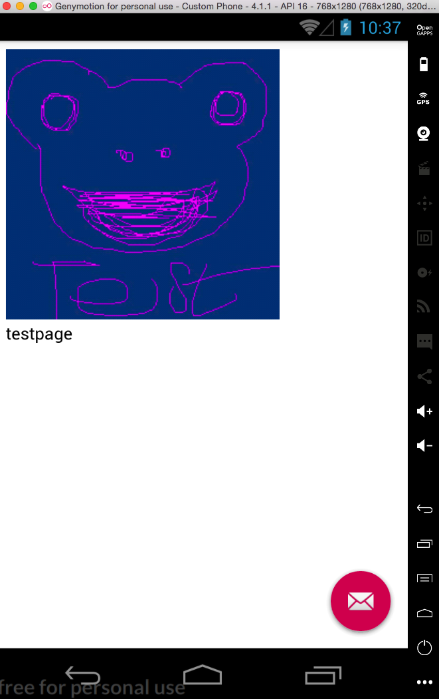
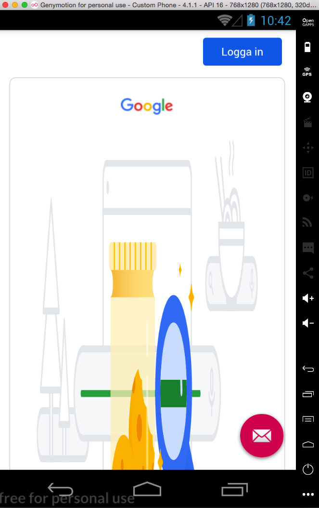

# Rapport
-------------------------------------------------------------------------------
Jag utgår i min rapport från den lista som fanns i MainActivity.java

        + Rename your App. Tip: Values->Strings
        + Enable Internet access for your App. Tip: Manifest

Detta gjordes med hjälp av följande kodrad i AndroidManifest.xml:
```
<uses-permission android:name="android.permission.INTERNET" />
```
        
        + Create a WebView element in the layout file content_main.xml
        + Give the WebView element ID "my_webview"
        -- Commit and push to your github fork

Kod för webview lades till i content_main.xml:
```
    <WebView
        android:id="@+id/my_webview"
        android:layout_width="match_parent"
        android:layout_height="match_parent"
        />
```

        + Create a private member variable called "myWebView" of type WebView
        + Locate the WebView element created in step 1 using the ID created in step 2
        + Create a new WebViewClient to attach to our WebView. This allows us to
          browse the web inside our app.
        -- Commit and push to your github fork

Följande kod läggs till under onCreate i MainActivity.java,
Vilket gör att koden körs när aktiviteten skapas (därav namnet 'onCreate'):

```
        //Lägger till WebView-element:
        myWebView = findViewById(R.id.my_webview);

        //Använd får egen WebViewClient
        WebViewClient myWebViewClient = new WebViewClient();
        myWebView.setWebViewClient(myWebViewClient);
```

        + Enable Javascript execution in your WebViewClient
        + Enter the url to load in our WebView
        -- Commit and push to your github fork

Följande kod i MainActivity.java lägger till en startsida + aktiverar Javscript.
Min startsida (startup.html) är till för att ge användaren lite mer än bara en tom sida vid starttillfället.

```
        //Enable Javascript

        WebSettings webSettings = myWebView.getSettings();
        webSettings.setJavaScriptEnabled(true);

        //Laddar en startsida
        myWebView.loadUrl("file:///android_asset/startup.html");
```

        + Move the code that loads a URL into your WebView into the two methods
          "showExternalWebPage()" and "showInternalWebPage()".
        + Call the "showExternalWebPage()" / "showInternalWebPage()" methods
          when you select menu options "External Web Page" or "Internal Web Page"
          respectively
        -- Commit and push to your github fork

Koden i MainActivity som läser in hemsidor uppdateras enligt instruktion (se nedan).
Jag använder google.com som extern sida och test.html som intern sida att ladda.
```
    public void showExternalWebPage(){
        myWebView.loadUrl("https://google.com");
    }

    public void showInternalWebPage(){
        myWebView.loadUrl("file:///android_asset/test.html");
    }
```

Menyalternativen (internal/external) anropas enligt instruktion såhär:

```
        //noinspection SimplifiableIfStatement
        if (id == R.id.action_external_web) {
            Log.d("==>","Will display external web page");
            showExternalWebPage();
            return true;
        }

        if (id == R.id.action_internal_web) {
            Log.d("==>","Will display internal web page");
            showInternalWebPage();
            return true;
        }
```

        + Take two screenshots using the "Take a screenshot" tool in the AVD
           showing your App. One (1) screenshot showing your internal web page and
           one (1) screenshot showing your external web page.
        */

Här är mina screenshots:




Jag kör för närvarande med en extern emulator (Genymotion) och har därför
inte tagit mina screenshots via AVD. Anledningen är att de interna emulatorerna på min dator
helt enkelt inte vill fungera utan ganska omständig fix (jag har felsökt massor och testat det mesta).
Denna tredjepartsemulator fungerade direkt och körs via plugin i Android Studio, dvs precis som
de interna emulatorerna. Så det kändes som en stabil lösning, och jag hoppas detta är ok för er.